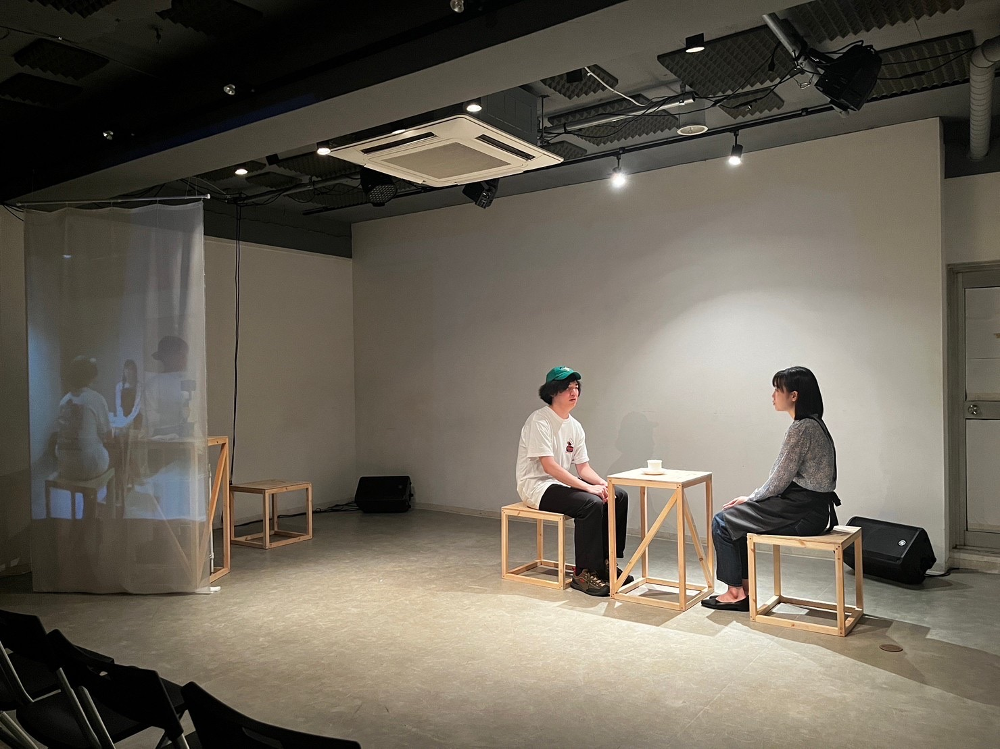

# SEE-YU-LATER
The video projection system used in the "SEE YU LATER".
  
  

  

## PREPARE
* MacBook Pro
  * TouchDesigner
  * Max/MSP
* iPhone 14 Pro
  * NDI HX CAMERA
* KORG nanoKONTROL 2  

## FUNCTION
* Camera Wireless Connection (NDI Connection)
* Video Effects
  * Perlin 3D Noise
  * Radial Blur
  * Blur
  * Light Tunnel
  * Twirl
  * Cache
  * Slit Scan
  * Bloom
* Video Recording and Playback
* Video Switching
* Projection Calibration  

## CONTROL
Video recording and playback and switching of video effects were controlled directly on the TouchDesigner screen. 
A system that can be controlled from a MIDI controller was built in for switching and applying effects.  

## Stage
  
  

## Effects  
 
 
 
 
